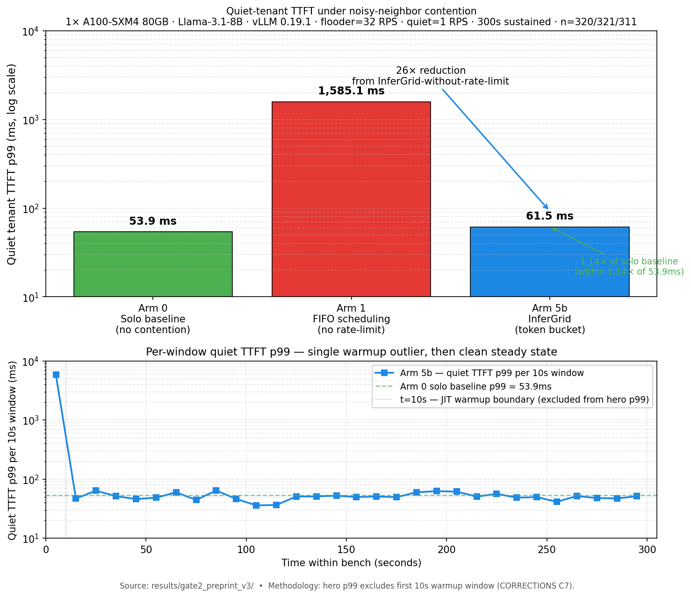

# InferGrid

**Tenant-fair LLM inference orchestration on a single GPU. No Kubernetes.**

InferGrid is middleware that sits on top of vLLM/SGLang and gives a quiet user predictable TTFT even when a noisy neighbor is hammering the same shared engine. One pip install. No cluster. No YAML pile.

## The hero number



Single A100-SXM4 80GB, Llama-3.1-8B, vLLM 0.19.1, two clients sharing one engine: a flooder at 32 RPS, a quiet user at 1 RPS, **300 s sustained**.

| | Quiet user TTFT p99 |
|---|---:|
| Solo (no contention) | 53.9 ms |
| InferGrid FIFO under flooder, no rate-limit | **1,585 ms** |
| InferGrid + token-bucket rate-limit | **61.5 ms** (within **1.14× of solo**) |

Ten lines of YAML. No application code change. **The quiet user is essentially unaware the flooder exists** — within 14% of the no-contention baseline.

p99 figures exclude the first 10 s warmup window (vLLM JIT-compile transient, single-spike outlier; see [CORRECTIONS C7](results/CORRECTIONS.md)). All 29 steady-state windows after t=10 s have quiet p99 between 36 ms and 65 ms.

Full writeup: [`results/gate2_preprint_v3/`](results/gate2_preprint_v3/) and the original 5-arm experimental arc at [`results/gate2_fairness_20260419/`](results/gate2_fairness_20260419/) (vLLM 0.8.5, 120 s — newer steady-state numbers in v3 are more honest for current vLLM users).

## What InferGrid is and isn't

InferGrid is a thin orchestration layer (~3,500 LOC) that sits between your app and vLLM/SGLang. It adds three things engines can't do internally:

1. **Per-tenant token-bucket rate limiting at the budget gate.** This is the load-bearing mechanism (validated empirically — see Gate 2-FAIRNESS results). Engines have no concept of a tenant; InferGrid does.
2. **Multi-model lifecycle management** on a single GPU — frequency+recency eviction, hot-swap routing, no-K8s.
3. **OpenAI-compatible HTTP API** in front of multiple engines, so your app code doesn't change.

It is **not** a vLLM/SGLang replacement. It runs them as subprocesses and proxies to them. It is **not** a Kubernetes alternative for datacenter workloads — Dynamo, llm-d, Mammoth do that better. It is **not** going to magically lower single-tenant TTFT — Gate 1.5 measured a robust DISCONFIRM there; vLLM's continuous batching matches a coarse upstream cap on single-tenant single-model workloads.

## Why InferGrid

Every existing solution requires Kubernetes or gives up tenant fairness:

| System | K8s Required | Multi-Model | Per-Tenant Fairness | Hardware |
|---|:---:|:---:|:---:|---|
| NVIDIA Dynamo v1.0 | Yes | Yes | No | NVIDIA only, datacenter |
| llm-d v0.5 (CNCF) | Yes | 1/pool | No | NVIDIA, datacenter |
| Mammoth (Modular) | Yes | Yes | No | NVIDIA + AMD, datacenter |
| AIBrix v0.6 | Yes | Yes | No | NVIDIA, datacenter |
| Ollama | No | LRU eviction | No | Multi, single node |
| Vanilla vLLM/SGLang | No | One model per process | No | Single node |
| **InferGrid** | **No** | **Yes (frequency+recency)** | **Yes (token bucket + DRR)** | **Single node, 1-4 GPUs** |

The "multi-tenant on a small shared box without K8s" cell is empty. That's the gap InferGrid fills.

## Quickstart

```bash
pip install -e .          # PyPI placeholder pending; until then, install from source
infergrid serve --config configs/quickstart_fairness.yaml

# Wait until /health returns 200. The first call returns 503 with a
# {missing_models: [...]} body until the configured engines finish
# loading (typically 30-90s for an 8B-class model on A100).
until curl -fs localhost:8000/health > /dev/null; do sleep 2; done

# Hit it as two tenants on the same model:
curl localhost:8000/v1/completions -H "X-Tenant-ID: noisy" \
  -d '{"model":"llama31-8b","prompt":"...","max_tokens":64,"stream":true}'
curl localhost:8000/v1/completions -H "X-Tenant-ID: quiet" \
  -d '{"model":"llama31-8b","prompt":"...","max_tokens":64,"stream":true}'

# Watch the rate-limit fire and the engine queue stay composed:
curl localhost:8000/metrics | grep -E "tenant_rejected|admission_queue_depth"
```

The [`quickstart_fairness.yaml`](configs/quickstart_fairness.yaml) is heavily commented. For a deeper "when to use which lever" treatment, see the [Tuning Guide](docs/tuning_guide.md) — every recommendation in it traces back to a specific experiment.

## Architecture

```
                    +---------------------+
                    |   WorkloadRouter    |  request profiling, length-bucket scheduling
                    +--------+------------+
                             |
              +--------------+--------------+
              |              |              |
     +--------v--------+ +--v---+ +--------v--------+
     |  CacheManager   | |Shared| | TenantManager   |  per-tenant token bucket + budget
     |  (KV lifecycle) | |State | | rate_limit_burst|
     +-----------------+ +------+ +-----------------+
              |                            |
     +--------v----------------------------v--------+
     |          vLLM / SGLang Engines (1-N)         |
     +----------------------------------------------+
```

| Component | What it does | Source |
|---|---|---|
| WorkloadRouter | Length-bucketed admission queue, length-aware scheduling, model lifecycle (freq+recency, not LRU), OpenAI-compatible HTTP API | `src/infergrid/router/router.py` (655 LOC) |
| AdmissionController | Concurrency cap with priority queue (lower=served first), Prometheus metrics, sub-ms fast-path | `src/infergrid/router/admission.py` (309 LOC) |
| CacheManager | KV cache block tracking across GPU/CPU/SSD tiers, weighted eviction (planned LMCache integration) | `src/infergrid/cache/manager.py` (487 LOC) |
| TenantManager | Per-tenant budgets, **token-bucket rate limiting** (refill + burst capacity), DRR priority scoring | `src/infergrid/tenant/manager.py` (267 LOC) |
| Engine Adapters | Subprocess management for vLLM/SGLang, health checks, HTTP proxying | `src/infergrid/engines/` (277 LOC) |

Total: 2,872 LOC src + 2,400+ LOC tests (144 unit tests passing).

## Empirical results

Each claim above traces to a specific experiment. Numbers are **honest** — TTFT measurement was rebuilt mid-project after a shadow review caught the original harness was timing SSE first-frame RTT, not first non-empty token (see `results/CORRECTIONS.md` C2/C5).

| Gate | Hardware | Spend | Verdict |
|---|---|---:|---|
| Gate 0 (system bring-up) | A100-SXM4 | $5.76 | PASS |
| Gate 0.6 (real-vLLM bench validation) | A100-SXM4 | $3.17 | PASS |
| Gate 1 (single-model admission cap, short bench) | H100 SXM5 | $1.00 | DISCONFIRM (under-powered, see Gate 1.5) |
| Gate 1.5 (powered rerun, 16k req/arm) | H100 SXM5 | $1.30 | **Robust DISCONFIRM** — single-model admission cap is not load-bearing |
| Gate 2-FAIRNESS (5 arms tenant fairness) | A100-SXM4 | $1.40 | **CONFIRM** — 523× starvation → ~30ms steady state with rate-limit |
| Gate 2-FAIRNESS Arm 5b (token bucket) | A100-SXM4 | $0.30 | **CLEAN CONFIRM** — quiet within 1.35× of solo, no warmup transient |
| Gate 2-FAIRNESS Arm 6 (DRR isolation) | A100-SXM4 | $0.30 | DRR not material on this workload — token bucket alone does the work |

Total compute spend: ~$13. Full raw artifacts and per-window traces in `results/`.

## Tests

```bash
pytest tests/unit/        # 144 tests, no GPU required, ~10 s
```

## Roadmap

| Phase | Status | Notes |
|---|---|---|
| Phase 1 — vLLM/SGLang profiling | ✅ Done | TTFT numbers under-counted by ~30ms (CORRECTIONS C2); honest TTFT shipped in PR #28/#31 |
| Phase 2 — Core implementation | ✅ Done | WorkloadRouter, AdmissionController, TenantManager, CacheManager, CLI |
| Gate 0 — first GPU bring-up | ✅ Done | A100-SXM4, system PASS |
| Gate 0.6 — bench harness validation | ✅ Done | Real vLLM end-to-end |
| Gate 1.5 — single-model admission test | ✅ Done | Falsified the original "scheduling cliff" pitch |
| Gate 2-FAIRNESS — multi-tenant fairness | ✅ Done | Hero number; this README's lead chart |
| **Launch** | **Tue 2026-05-12** | HN + r/LocalLLaMA + landing page; ship-gated on PyPI placeholder + Cloudflare Worker |
| Gate 2-lite — multi-model contention | Post-launch | InferGrid's other differentiator vs Ollama; never benchmarked |
| KV cache tiering (LMCache integration) | Post-launch | Phase 3 of original roadmap |
| Multi-engine routing (vLLM ↔ SGLang) | Post-launch | Phase 1 hinted SGLang 2.2× better at TTFT at c=256 |

## Research artifacts

- [Gate 2-FAIRNESS OUTCOME](results/gate2_fairness_20260419/GATE2_FAIRNESS_OUTCOME.md) + [SUPPLEMENT (Arm 5b)](results/gate2_fairness_20260419/GATE2_FAIRNESS_SUPPLEMENT_arm5b.md) + [SUPPLEMENT (Arm 6)](results/gate2_fairness_20260419/GATE2_FAIRNESS_SUPPLEMENT_arm6.md)
- [Gate 1.5 OUTCOME](results/gate1_5_20260419/GATE1_5_OUTCOME.md)
- [Gate 1 OUTCOME (with Little's Law caveat)](results/gate1_20260419/GATE1_OUTCOME.md)
- [Tuning Guide](docs/tuning_guide.md) — when to use which lever, with empirical evidence
- [Inference Orchestration Gap Analysis](docs/inference_orchestration_gaps_report.md) — competitive landscape (April 2026)
- [Corrections / measurement honesty log](results/CORRECTIONS.md) — every metric we under-counted and the fix

## Contributing

See [CONTRIBUTING.md](CONTRIBUTING.md). Bug reports especially welcome with a `prometheus_dump.txt` and `server.log` — that's worth more to us than a star.

## License

MIT
