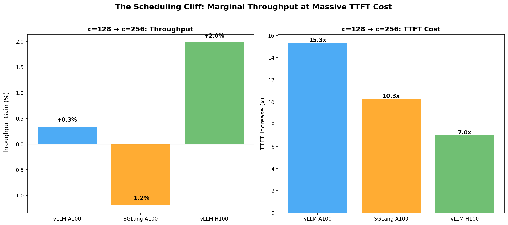
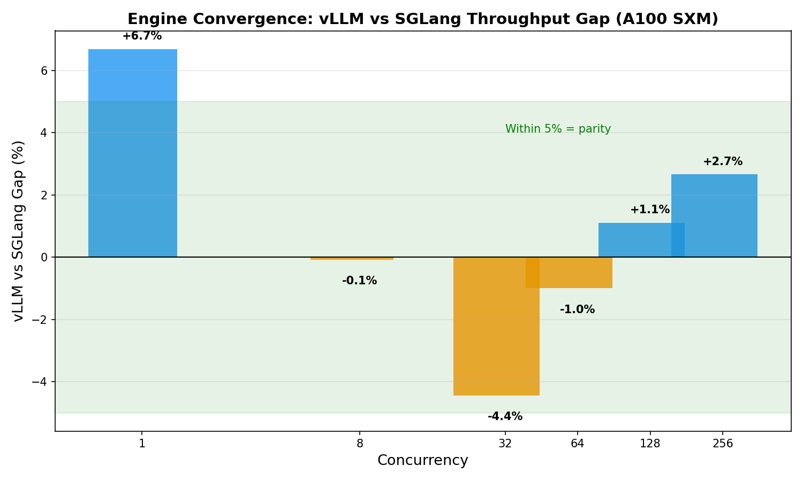
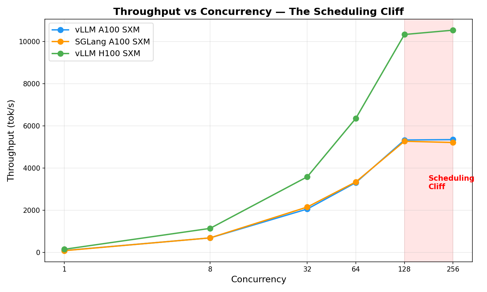

# InferGrid — Investor Summary

## Problem

LLM inference orchestration today requires Kubernetes and datacenter infrastructure. Developers running 1-4 GPUs on bare metal have exactly two options: Ollama (naive LRU eviction, no scheduling intelligence) or manual vLLM instances (one model per process, no shared memory). There is no intelligent multi-model orchestration layer for small-scale deployments.

Meanwhile, every inference engine hits a **scheduling cliff** at high concurrency: doubling load from 128 to 256 concurrent requests yields only +2% throughput but +718% worse time-to-first-token. Requests pile up in the scheduler queue and users experience multi-second delays. No existing tool manages this.

## Solution

**InferGrid** is middleware that sits on top of vLLM and SGLang. One command to serve multiple models with intelligent orchestration:

```
pip install infergrid
infergrid serve llama-8b qwen-7b --gpu-budget 80%
```

- **Multi-model lifecycle management** -- frequency+recency eviction, not LRU
- **Admission control** -- keeps TTFT under SLO targets by shedding load before the scheduling cliff
- **KV cache tiering** -- GPU HBM, CPU DRAM, NVMe SSD (planned, via LMCache integration)
- **Per-tenant isolation** -- software resource budgets without static GPU partitioning
- **No Kubernetes. No YAML. No cluster.**

## Market Validation

The market for inference orchestration is proven and growing:

- **Gimlet Labs** raised $92M (Menlo Ventures-led Series A), reports eight-figure revenues, serves a top-3 frontier lab and a top-3 hyperscaler. Validates heterogeneous inference as a real business.
- **Modular** acquired BentoML, launched Mammoth orchestrator, valued at $1.6B. K8s-native datacenter play.
- **NVIDIA Dynamo v1.0** shipped March 2026 with 18+ deployment partners. NVIDIA-only, datacenter-only.
- **llm-d** entered CNCF Sandbox (March 2026), backed by Red Hat, Google Cloud, IBM, CoreWeave. K8s-mandatory.

All of these require Kubernetes or managed cloud. The 1-4 GPU developer segment is unserved.

## Traction

**Phase 1 profiling complete** on A100 SXM and H100 SXM GPUs with two novel findings:

**1. The Scheduling Cliff** -- At concurrency >128, vLLM delivers +2% throughput but +718% worse TTFT (22ms to 2.6s). This cliff exists on all hardware and both engines. InferGrid's admission controller prevents requests from entering this regime.



**2. Engine Convergence** -- The vLLM-SGLang throughput gap does not exist (<5% difference). This contradicts 2024 findings and means the optimization opportunity is in scheduling quality, not engine selection. SGLang has 2.2x better TTFT at saturation.



**Core system implemented:** 3,453 LOC across WorkloadRouter, CacheManager, TenantManager, and CLI. 1,257 LOC admission controller with concurrency-aware load shedding.



## Differentiation

| | K8s Required | Multi-Model | KV Tiering | Admission Control | Target Scale |
|---|:---:|:---:|:---:|:---:|---|
| **InferGrid** | **No** | **Intelligent** | **Planned** | **Yes** | 1-4 GPUs |
| Dynamo v1.0 | Yes | Yes | KVBM | No | Datacenter |
| llm-d v0.5 | Yes | 1 model/pool | LMCache | No | Datacenter |
| Mammoth (Modular) | Yes | Yes | Via backends | No | Datacenter |
| Ollama | No | LRU only | No | No | Single node |
| Gimlet Labs | Managed cloud | Yes | Yes | Unknown | Cloud |

InferGrid is the only project combining no-K8s deployment with intelligent scheduling and KV cache tiering.

## Ask

Seed funding for a 12-week sprint to public beta:

- **Weeks 1-4:** Multi-model demo with 70B parameter models (Llama 3.1 70B, Qwen 72B)
- **Weeks 5-8:** KV cache tiering integration (LMCache), comprehensive benchmarks vs. Ollama and manual vLLM
- **Weeks 9-12:** arXiv preprint, HN launch, public beta release

## Team

**Shrey Patel** -- Founder. Built the core system, ran all profiling, authored the gap analysis. Focused on closing the space between Ollama simplicity and datacenter orchestration intelligence.
